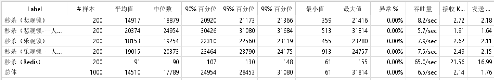

## README   

此项目展示了秒杀系统下单的三种实现方式：悲观锁、乐观锁和Redis。

200线程，3秒内完成，100个商品。压测性能如下：

整体上，悲观锁和乐观锁的性能差别不大。但是乐观锁在刚启动的时候吞吐量只能达到30/min，整体的吞吐量是被无商品时的吞吐量抬起来的。因为在高并发的情况下，乐观锁的冲突很高，需要不断地重试。100个库存只下单了十几个。

悲观锁的性能很稳定，一开始就有5/sec。100个库存全部下单。

**说明**

1. 异步下单在生产中应该使用MQ。

